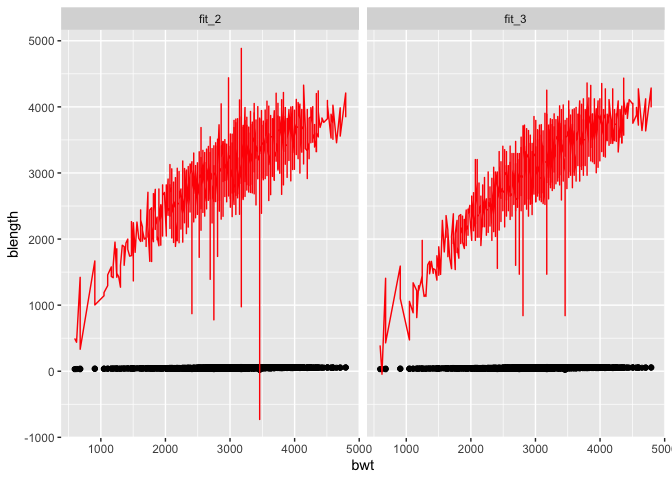

p8105_hw6_nl2835
================
Nancy Le
2023-11-27

## Problem 2

``` r
weather_df = 
  rnoaa::meteo_pull_monitors(
    c("USW00094728"),
    var = c("PRCP", "TMIN", "TMAX"), 
    date_min = "2022-01-01",
    date_max = "2022-12-31") |>
  mutate(
    name = recode(id, USW00094728 = "CentralPark_NY"),
    tmin = tmin / 10,
    tmax = tmax / 10) |>
  select(name, id, everything())
```

``` r
boot_sample = function(weather_df) {
  sample_n(weather_df, size = nrow(weather_df), replace = TRUE)
}
```

``` r
bootstrap_reg <- function(df) {
  regression <- lm(tmax ~tmin + prcp, data = df)
  r2 <- summary(regression)$r.squared
  beta_1 <- coef(regression)["tmin"]
  beta_2 <- coef(regression)["prcp"]
  beta_inter <- beta_1 * beta_2 
  
  if (beta_inter <= 0) {
    logbetainter <- NA } else {
      logbetainter <- log(beta_inter)
    }
  
  tibble(r2 = r2, logbetainter = log(beta_inter))
}

boot_straps <- 
  tibble(strap_number = 1:5000) |> 
  mutate(
    strap_sample = map(strap_number, ~boot_sample(weather_df)), 
    bootstrap_results = map_dfr(strap_sample, ~bootstrap_reg(.x |> as_tibble()))
  )
## Warning: There were 3361 warnings in `mutate()`.
## The first warning was:
## ℹ In argument: `bootstrap_results = map_dfr(strap_sample,
##   ~bootstrap_reg(as_tibble(.x)))`.
## Caused by warning in `log()`:
## ! NaNs produced
## ℹ Run `dplyr::last_dplyr_warnings()` to see the 3360 remaining warnings.
```

``` r
boot_straps
## # A tibble: 5,000 × 3
##    strap_number strap_sample       bootstrap_results$r2 $logbetainter
##           <int> <list>                            <dbl>         <dbl>
##  1            1 <tibble [365 × 6]>                0.898         -5.44
##  2            2 <tibble [365 × 6]>                0.928        NaN   
##  3            3 <tibble [365 × 6]>                0.925        NaN   
##  4            4 <tibble [365 × 6]>                0.931        NaN   
##  5            5 <tibble [365 × 6]>                0.915        NaN   
##  6            6 <tibble [365 × 6]>                0.918         -7.18
##  7            7 <tibble [365 × 6]>                0.922        NaN   
##  8            8 <tibble [365 × 6]>                0.910         -6.65
##  9            9 <tibble [365 × 6]>                0.910         -6.21
## 10           10 <tibble [365 × 6]>                0.939        NaN   
## # ℹ 4,990 more rows
```

``` r
ggplot(boot_straps, aes(x = bootstrap_results$r2)) +
  geom_histogram(binwidth = 0.01, fill = "blue", color = "black") + 
  labs(title = "R-squared Estimates Distribution", 
       x = "R^2",
       y = "Frequency")
```

<!-- -->

The distribution of r-squared estimates centers around R2 = 0.92 and is
a symmetric distribution.

``` r
ggplot(boot_straps, aes(x = bootstrap_results$logbetainter)) +
  geom_histogram(binwidth = 0.05, fill = "lightgreen", color = "black") + 
  labs(title = "Log Interaction Estimates", 
       x = "log(beta1*beta2)",
       y = "Frequency")
## Warning: Removed 3361 rows containing non-finite values (`stat_bin()`).
```

-1.png)<!-- -->

The distribution of log(b0 \* b1) estimates is skewed left, with a
median around -6.

``` r
r_squared_quantiles <- quantile(boot_straps$bootstrap_results$r2, probs = c(0.025, 0.975), na.rm = TRUE)
```

``` r
logbetainter_quantiles <- quantile(boot_straps$bootstrap_results$logbetainter, probs = c(0.025, 0.975), na.rm = TRUE)
```

``` r
r_squared_quantiles
##      2.5%     97.5% 
## 0.8885495 0.9406812
logbetainter_quantiles
##      2.5%     97.5% 
## -8.981559 -4.601673
```

## Problem 3

``` r
birthweight <-
  read.csv("./local/birthweight.csv") |> 
  janitor::clean_names() |> 
  mutate(
    babysex = as.factor(babysex),
    frace = as.factor(frace), 
    malform = as.factor(malform),
    mrace = as.factor(mrace)
  ) |> 
  na.omit()
```

``` r
fit = lm(bwt ~ ppwt, data = birthweight)

fit |> 
  broom::tidy() 
## # A tibble: 2 × 5
##   term        estimate std.error statistic  p.value
##   <chr>          <dbl>     <dbl>     <dbl>    <dbl>
## 1 (Intercept)  2541.      47.4        53.6 0       
## 2 ppwt            4.65     0.379      12.3 5.69e-34
```

My proposed regression model is based on the hypothesis that baby’s
birthweight depends on the mother’s pre-pregnancy weight (in pounds).

``` r
birthweight |> 
  modelr::add_residuals(fit) |> 
  modelr::add_predictions(fit) |> 
  ggplot(aes(x = ppwt, y = bwt)) + geom_point()
```

<!-- -->

Within my model, I’m adding the residuals and fitted values to the
birthweight dataframe.

``` r
fit_2 = lm(bwt ~ blength + gaweeks, data = birthweight)

fit_2 |> 
  broom::tidy() 
## # A tibble: 3 × 5
##   term        estimate std.error statistic  p.value
##   <chr>          <dbl>     <dbl>     <dbl>    <dbl>
## 1 (Intercept)  -4348.      98.0      -44.4 0       
## 2 blength        129.       1.99      64.6 0       
## 3 gaweeks         27.0      1.72      15.7 2.36e-54
```

``` r
fit_3 = lm(bwt ~ bhead + blength + babysex + bhead * blength + bhead * babysex + blength * babysex + bhead * blength * babysex, data = birthweight)

fit_3 |> 
  broom::tidy() 
## # A tibble: 8 × 5
##   term                    estimate std.error statistic      p.value
##   <chr>                      <dbl>     <dbl>     <dbl>        <dbl>
## 1 (Intercept)            -7177.     1265.       -5.67  0.0000000149
## 2 bhead                    182.       38.1       4.78  0.00000184  
## 3 blength                  102.       26.2       3.90  0.0000992   
## 4 babysex2                6375.     1678.        3.80  0.000147    
## 5 bhead:blength             -0.554     0.780    -0.710 0.478       
## 6 bhead:babysex2          -198.       51.1      -3.88  0.000105    
## 7 blength:babysex2        -124.       35.1      -3.52  0.000429    
## 8 bhead:blength:babysex2     3.88      1.06      3.67  0.000245
```

``` r
birthweight |> 
  gather_predictions(fit_2, fit_3) |> 
  ggplot(aes(x = bwt, y = blength)) + 
  geom_point() +
  geom_line(aes( y = pred), color = "red") + 
  facet_wrap(~model)
```

<!-- -->

``` r
rmse(fit, birthweight)
## [1] 503.4576
rmse(fit_2, birthweight)
## [1] 333.1023
rmse(fit_3, birthweight)
## [1] 287.4692
```

``` r
birthweight <- birthweight |> 
    modelr::add_residuals(fit) |> 
    modelr::add_predictions(fit) |>
    modelr::add_residuals(fit_2) |> 
    modelr::add_predictions(fit_2) |>
    modelr::add_residuals(fit_3) |> 
    modelr::add_predictions(fit_3)  
    
```
